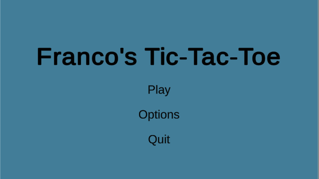
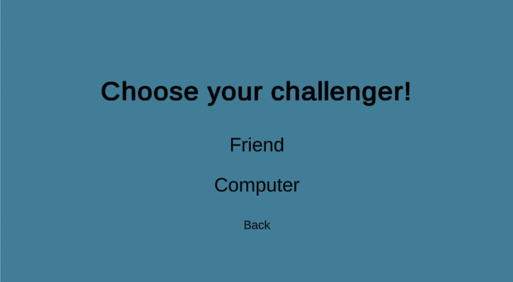
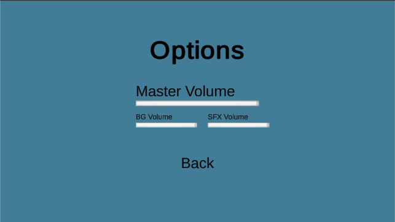
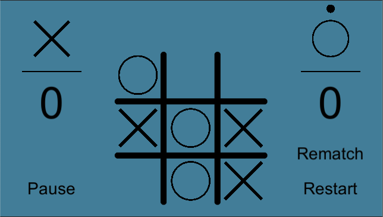
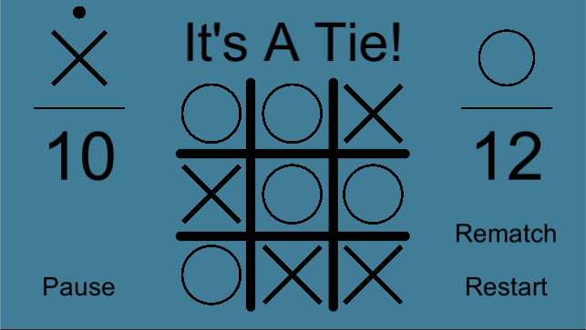
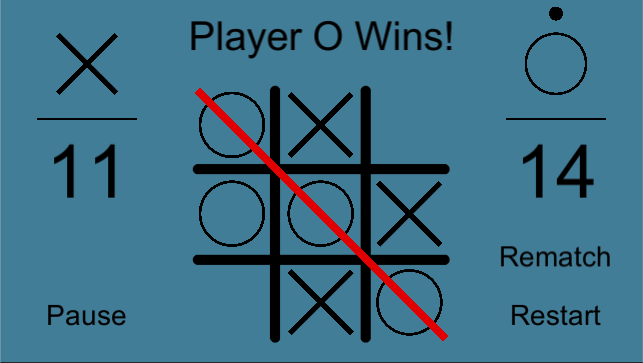

# Tic-Tac-Toe

The classic game of Tic-Tac-Toe where you can play with your friend or a computer!
This project was created in Unity and scripts were created in C#.

A link to a playthrough can be viewed [here!](https://www.youtube.com/watch?v=vpDYokSOYrQ&feature=youtu.be)

## Table of contents
* [Gameplay](#gameplay)
* [Features](#features)
* [Credit](#credit)
* [Afterthoughts](#afterthoughts)

## Gameplay
[Youtube link of playthrough](https://www.youtube.com/watch?v=vpDYokSOYrQ&feature=youtu.be)

  
   
  

  
   
  

## Features
The project was originally going to stop after I made a working game, but I thought why not add some more?

Here's a list of some of the things I created after making the basic game functionality.  At the end of this section are improvements I could make if I pick this project back up again.

### AI
- Hard(Implements a MinMax Algorithm and Alpha Beta Pruning to control AI that either wins or ties (never loses))
- Easy(Picks random square)

### Audio
- Background Music
- SFX (Clicking)

### UI
- Menus (a lot)
  - Main menu
  - Options
  - Opponent Picking
  - AI Difficulty
- Volume Sliders (Implementing Unity's Audio Mixers)

### Future Improvements
If I pick up this project again, here's a list of some of the things I'd improve on.
- Adding pictures to the README.md
- Documentation (period)
- Better UI (could look prettier)
  - Scene transitions
  - Another intro screen
- More SFX (victory/lose noise)
- AI
  - Show a waiting animation to show AI is still thinking of move (Hard AI)
  - AI vs AI
  - Allow AI to start first (X) (functionality added already)
  - Add a medium difficulty
  - Allow AI to switch midgame
  - Hard AI takes too long to make first move (around 25 seconds, but less than one second afterwards)
  - Player is allowed to make a move while AI is still calculating move (only a problem for the Hard AI)

## Credit
### Basic Functionality - [InfoGamer](https://www.youtube.com/channel/UCyoayn_uVt2I55ZCUuBVRcQ)
Majority of the base functionality was created with the help of InfoGamer and their videos walking through creating a basic tic-tac-toe UI
### Menu and Volume Control - [Brackeys](https://www.youtube.com/channel/UCYbK_tjZ2OrIZFBvU6CCMiA)
The design of the menu (although very generic) was inspired by Brackey's videos.
### Music - [Club Penguin](https://en.wikipedia.org/wiki/Club_Penguin)
The background music comes from [Club Penguin OST - Coffee Shop](https://www.youtube.com/watch?v=K4eQ1avGci0&list=RDQM5kNtowCSBt8&index=14)
### AI(MinMax Algorithm) - [Paul N. Hilfinger](https://www2.eecs.berkeley.edu/Faculty/Homepages/hilfinger.html)
The MinMax Algorithm with Alpha-Beta Pruning code was heavily inspired by code I wrote for one of my courses in UC Berkeley, Professor Hilfinger's CS61B

## Afterthoughts
This project was a great introduction to C#, Unity, and game developing in general!  Now that I finished my project, I realize not only how doable making a game is, but how hard it is! For such a simple game like tic-tac-toe took a bunch of days creating and improving.  I definitely wish I planned all the features I was going to add beforehand so I wouldn't have had to constantly go back and change things.  And to think this is a game with no movement.  After watching tons of videos on Unity and game developing, especially when I got distracted watching how to create Flappy Bird and parallax effect backgrounds, I definitely want to learn and make some more!

Also I'll definitely use branches next time!
